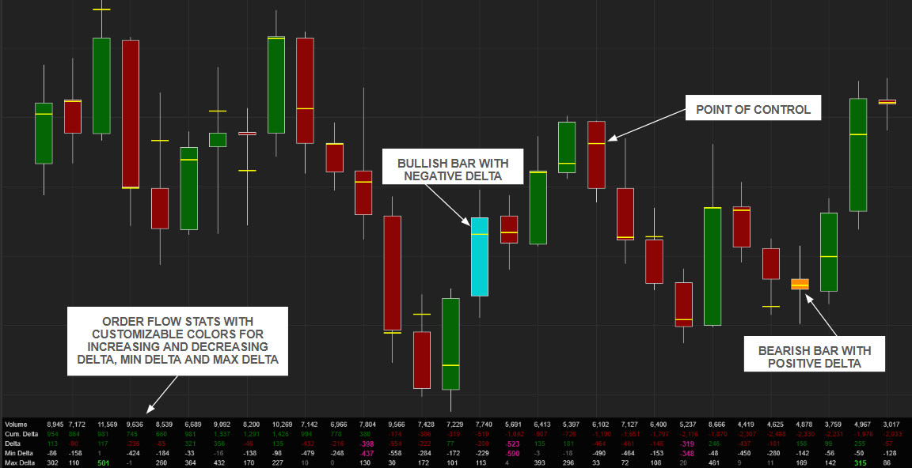

# Order Flow Stats

**Requires the lifetime NinjaTrader license for the volumetric data or the Order Flow + subscription.**

**_Important:_** The Volumetric Period, Volumetric Bars Type and Ticks Per Level must match the one on the chart.

Normal volumetric charts have wide bars with additional data that limits the number of bars you can have on your chart. This displays some of the statistics on non-volumetric charts using the a volumetric data series.

Features:

- Set table per bar or show only last
- Set number of columns to show
- Customizable colors. Customizable colors for increasing and decreasing delta, min delta and max delta
- Point of Control per bar
- Painted bullish/negative delta and bearish/positive delta bars to indicate a divergence in delta and price.

Add-On Download: https://github.com/WaleeTheRobot/order-flow-stats/releases
